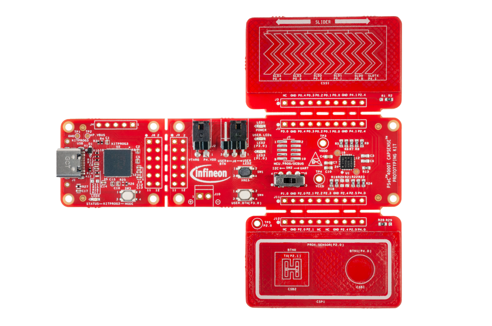

# CY8CPROTO-040T BSP

## Overview

The PSoC™ 4000T CAPSENSE™ Prototyping Kit enables you to evaluate and develop with Cypress's fifth-generation, low-power CAPSENSE™ solution using the PSoC™ 4000T device.

To use code from the BSP, simply include a reference to `cybsp.h`.

## Features

### Kit Features:

* World's Most Reliable, Lowest Power CAPSENSE™ Solution
* On-board Programmer and Debugger

### Kit Contents:

* CY8CPROTO-040T PSoC™ 4000T CAPSENSE™ Prototyping Kit 
* Quick Start Guide

## BSP Configuration

The BSP has a few hooks that allow its behavior to be configured. Some of these items are enabled by default while others must be explicitly enabled. Items enabled by default are specified in the CY8CPROTO-040T.mk file. The items that are enabled can be changed by creating a custom BSP or by editing the application makefile.

Components:
* Device specific category reference (e.g.: CAT1) - This component, enabled by default, pulls in any device specific code for this board.

Defines:
* CYBSP_WIFI_CAPABLE - This define, disabled by default, causes the BSP to initialize the interface to an onboard wireless chip if it has one.
* CY_USING_HAL - This define, enabled by default, specifies that the HAL is intended to be used by the application. This will cause the BSP to include the applicable header file and to initialize the system level drivers.
* CYBSP_CUSTOM_SYSCLK_PM_CALLBACK - This define, disabled by default, causes the BSP to skip registering its default SysClk Power Management callback, if any, and instead to invoke the application-defined function `cybsp_register_custom_sysclk_pm_callback` to register an application-specific callback.

### Clock Configuration

| Clock    | Source    | Output Frequency |
|----------|-----------|------------------|
| CLK_HF   | CLK_IMO   | 48 MHz           |

### Power Configuration

* System Idle Power Mode: Deep Sleep
* VDDA Voltage: 5000 mV
* VDDD Voltage: 5000 mV

See the [BSP Setttings][settings] for additional board specific configuration settings.

## API Reference Manual

The CY8CPROTO-040T Board Support Package provides a set of APIs to configure, initialize and use the board resources.

See the [BSP API Reference Manual][api] for the complete list of the provided interfaces.

## More information
* [CY8CPROTO-040T BSP API Reference Manual][api]
* [CY8CPROTO-040T Documentation](https://www.infineon.com/cms/en/product/evaluation-boards/cy8cproto-040t)
* [Cypress Semiconductor, an Infineon Technologies Company](http://www.cypress.com)
* [Infineon GitHub](https://github.com/infineon)
* [ModusToolbox™](https://www.cypress.com/products/modustoolbox-software-environment)

[api]: https://infineon.github.io/TARGET_CY8CPROTO-040T/html/modules.html
[settings]: https://infineon.github.io/TARGET_CY8CPROTO-040T/html/md_bsp_settings.html

---
© Cypress Semiconductor Corporation (an Infineon company) or an affiliate of Cypress Semiconductor Corporation, 2019-2022.